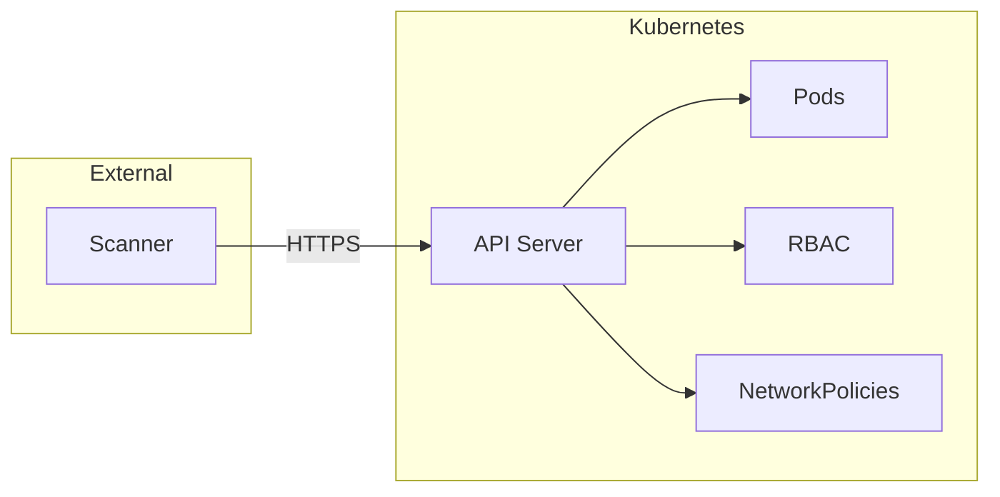
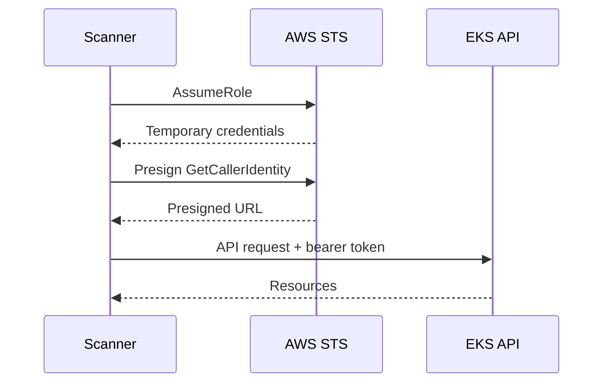
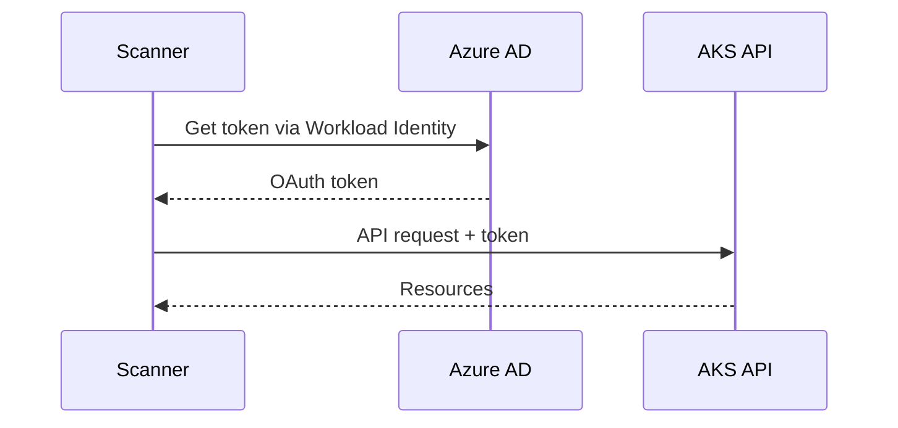
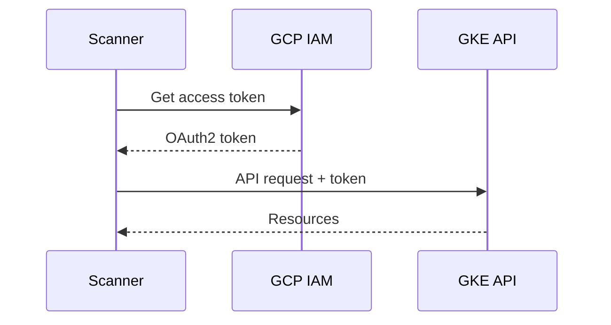
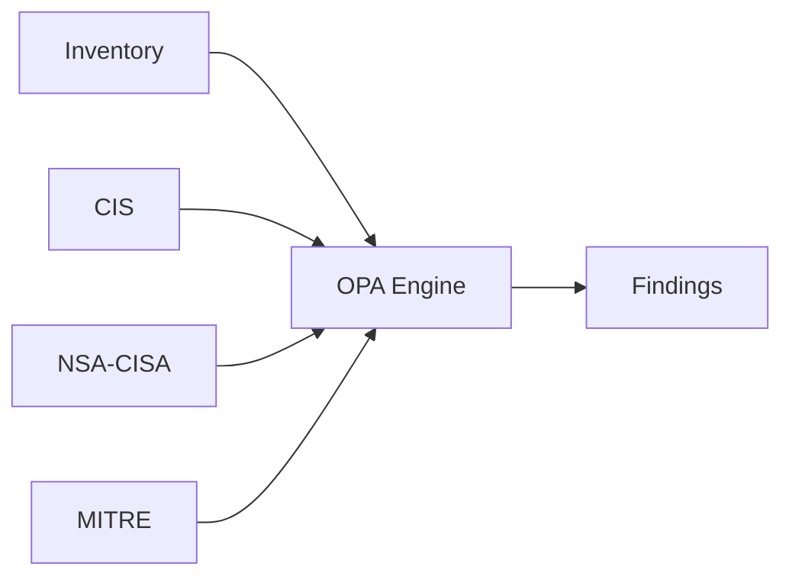
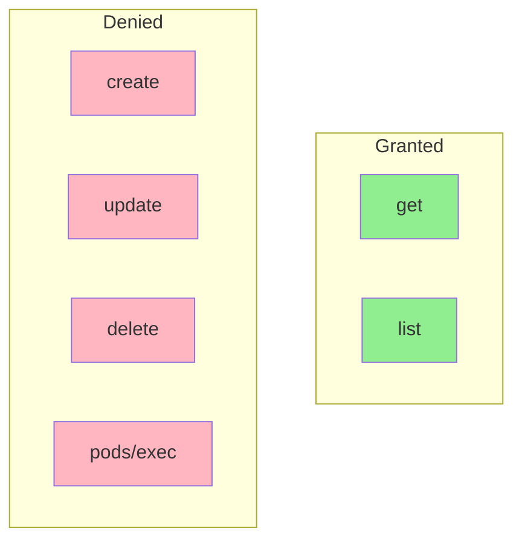
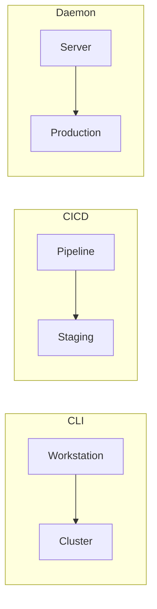

# Agentless Kubernetes Security Scanning

## Problem

Traditional Kubernetes security tools deploy agents into every cluster. For organizations with hundreds of clusters across cloud providers, this creates operational overhead: agent maintenance, resource consumption, and additional attack surface.

## Approach

This scanner connects remotely via the Kubernetes API. No pods, daemonsets, or sidecars are deployed to target clusters.



The scanner makes read-only API calls to collect inventory, then evaluates against security policies locally.

## Authentication

All authentication uses short-lived tokens.

### AWS EKS



Uses the same token mechanism as aws-iam-authenticator. Creates a presigned STS GetCallerIdentity request encoded as a Kubernetes bearer token.

### Azure AKS



Uses Azure AD tokens from Managed Identity or Workload Identity.

### GCP GKE



Uses OAuth2 tokens from Application Default Credentials or Workload Identity Federation.

## Data Collection

| Collected | Not Collected |
|-----------|---------------|
| Pods, Deployments | Secret values |
| RBAC rules | ConfigMap values |
| NetworkPolicies | Pod logs |
| ServiceAccounts | Pod exec |
| Secret metadata | Environment values |

## Compliance Evaluation

OPA/Rego policies evaluate collected resources against security frameworks.



### Policy Example

```rego
deny[result] {
    pod := input.workloads.pods[_]
    container := pod.containers[_]
    container.securityContext.privileged == true

    result := {
        "message": "Container runs in privileged mode",
        "resource": {"kind": "Pod", "name": pod.name}
    }
}
```

### Frameworks

- CIS Kubernetes Benchmark v1.10.0, v1.11.0
- CIS EKS Benchmark v1.6.0
- CIS AKS Benchmark v1.6.0
- CIS OpenShift Benchmark v1.7.0
- Kubernetes/EKS/AKS/OpenShift Best Practices
- NSA/CISA Kubernetes Hardening Guide
- MITRE ATT&CK for Kubernetes

## RBAC

ClusterRole grants only get and list verbs:



## Deployment



1. CLI: On-demand scans
2. CI/CD: Pre-deployment checks
3. Daemon: Scheduled scanning

## Security Controls

| Control | Implementation |
|---------|----------------|
| Zero credential storage | IAM roles, Workload Identity |
| Read-only access | get/list verbs only |
| Minimal data collection | No secret values |
| Network encryption | TLS 1.2+ |
| Credentials | Environment variables only |
