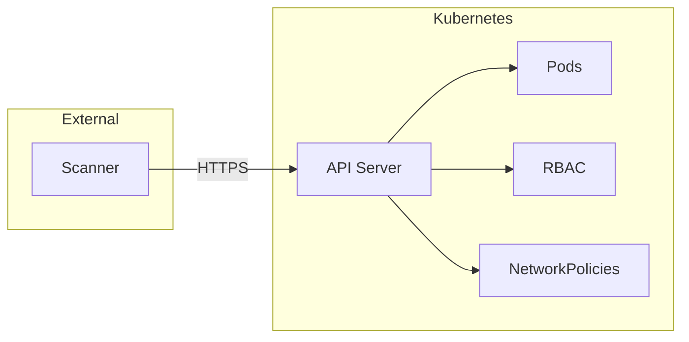
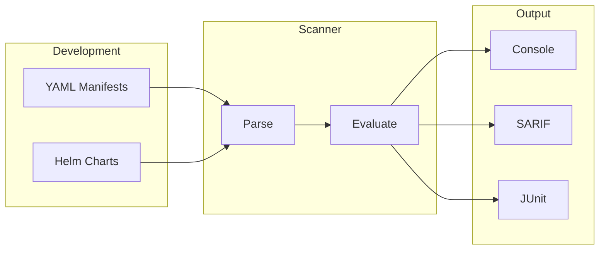
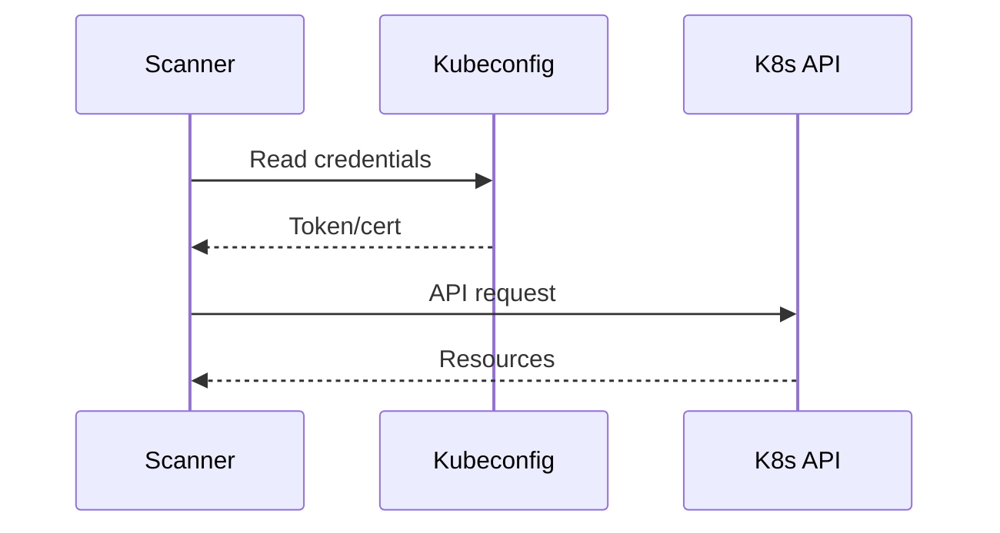
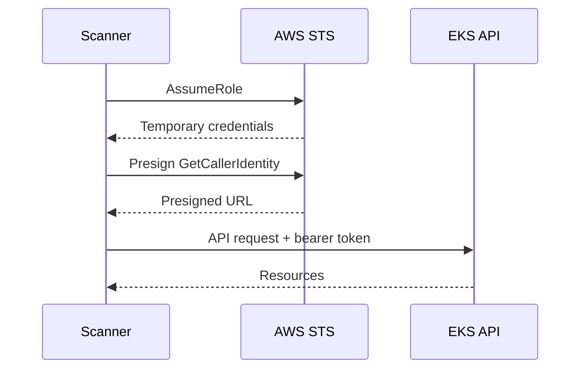
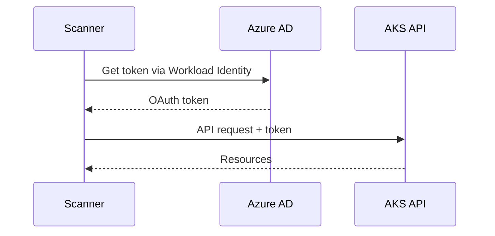
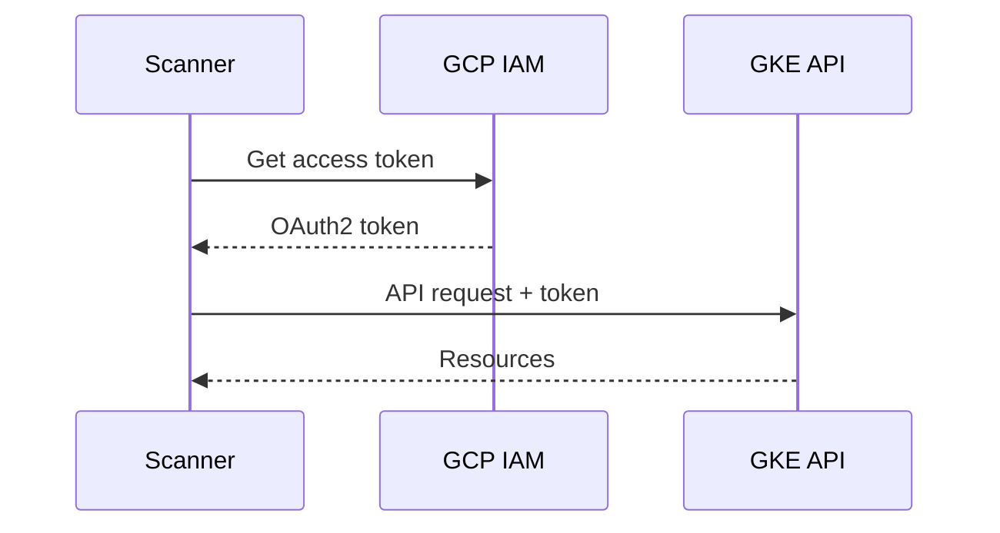
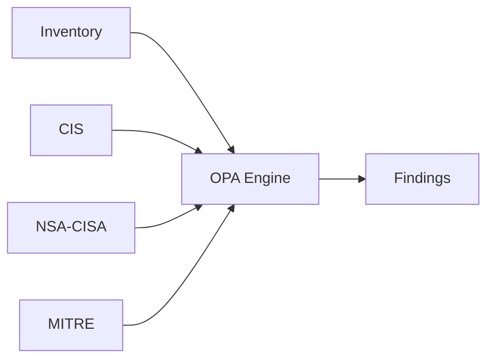
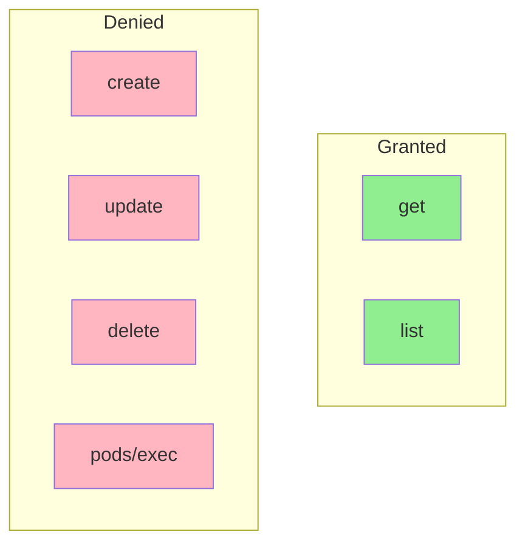
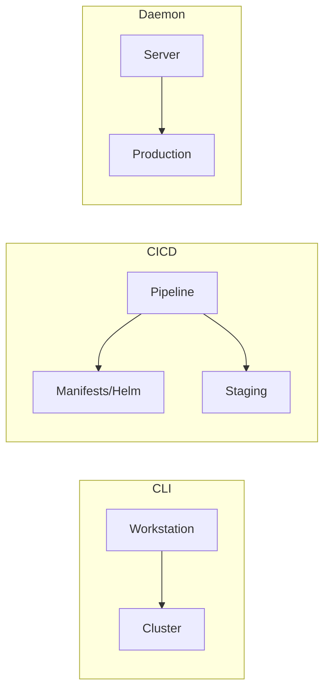

# Agentless Kubernetes Security Scanning

## Problem

Traditional Kubernetes security tools deploy agents into every cluster. For organizations with hundreds of clusters across cloud providers, this creates operational overhead: agent maintenance, resource consumption, and additional attack surface.

## Approach

This scanner connects remotely via the Kubernetes API. No pods, daemonsets, or sidecars are deployed to target clusters.



The scanner makes read-only API calls to collect inventory, then evaluates against security policies locally.

## Supported Platforms

Works with any Kubernetes distribution:

| Platform | Authentication |
|----------|----------------|
| Any K8s | kubeconfig |
| OpenShift | oc login / kubeconfig |
| Rancher | Rancher UI kubeconfig |
| k3s | /etc/rancher/k3s/k3s.yaml |
| k0s | k0s kubeconfig |
| MicroK8s | microk8s config |
| Kind/Minikube | Local kubeconfig |
| AWS EKS | IAM / IRSA |
| Azure AKS | Azure AD / Workload Identity |
| GCP GKE | GCP IAM / Workload Identity |

## Shift-Left Scanning

Security checks run before deployment:



Scan manifests and Helm charts in CI/CD pipelines:

```bash
# YAML manifests
qualys-k8s scan-manifest deployment.yaml
qualys-k8s scan-manifest ./manifests/

# Helm charts
qualys-k8s scan-helm ./my-chart
qualys-k8s scan-helm ./my-chart -f values-prod.yaml

# CI/CD thresholds
qualys-k8s scan-manifest ./manifests --compliance-threshold 80
qualys-k8s scan-helm ./chart --severity-threshold high --output junit
```

## Authentication

All authentication uses short-lived tokens.

### Kubeconfig (Any Cluster)



Works with OpenShift, Rancher, k3s, on-prem, or any Kubernetes cluster.

### AWS EKS



Uses the same token mechanism as aws-iam-authenticator.

### Azure AKS



Uses Azure AD tokens from Managed Identity or Workload Identity.

### GCP GKE



Uses OAuth2 tokens from Application Default Credentials or Workload Identity Federation.

## Data Collection

| Collected | Not Collected |
|-----------|---------------|
| Pods, Deployments | Secret values |
| RBAC rules | ConfigMap values |
| NetworkPolicies | Pod logs |
| ServiceAccounts | Pod exec |
| Secret metadata | Environment values |

## Compliance Evaluation

OPA/Rego policies evaluate collected resources against security frameworks.



### Policy Example

```rego
deny[result] {
    pod := input.workloads.pods[_]
    container := pod.containers[_]
    container.securityContext.privileged == true

    result := {
        "message": "Container runs in privileged mode",
        "resource": {"kind": "Pod", "name": pod.name}
    }
}
```

### Frameworks

| Framework | Coverage |
|-----------|----------|
| CIS Kubernetes v1.10, v1.11 | 32 controls (Section 5) |
| CIS EKS v1.6 | 35 controls |
| CIS AKS v1.6 | 28 controls |
| CIS OpenShift v1.7 | 23 controls |
| Kubernetes Best Practices | 60 controls |
| EKS/AKS/OpenShift Best Practices | 56+ controls each |
| NSA/CISA Hardening | 15 controls |
| MITRE ATT&CK | 15 controls |

## RBAC

ClusterRole grants only get and list verbs:



## Deployment Options



1. CLI: On-demand scans from workstation
2. CI/CD: Pre-deployment manifest/Helm checks + staging scans
3. Daemon: Scheduled production scanning

## Build Options

| Build | Size | Includes |
|-------|------|----------|
| Full | ~70MB | Helm + managed K8s auth |
| No Helm | ~58MB | Managed K8s auth only |
| Minimal | ~10MB | Kubeconfig auth only (UPX compressed) |

The minimal build works with any Kubernetes cluster. Managed K8s auth SDKs (AWS/Azure/GCP) are only for automatic credential fetching.

## Security Controls

| Control | Implementation |
|---------|----------------|
| Zero credential storage | IAM roles, Workload Identity |
| Read-only access | get/list verbs only |
| Minimal data collection | No secret values |
| Network encryption | TLS 1.2+ required |
| Credentials | Environment variables only |
| Response size limits | 50MB max |
| No redirects | Disabled for security |
