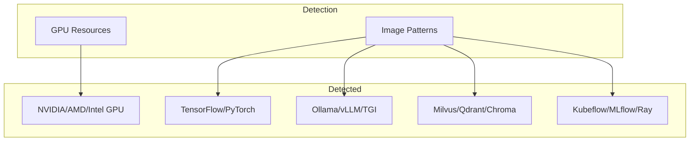
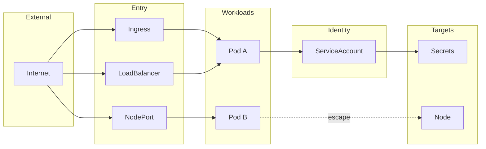

# Agentless Kubernetes Security Scanning

## Problem

Traditional Kubernetes security tools deploy agents into every cluster. For organizations with hundreds of clusters across cloud providers, this creates operational overhead: agent maintenance, resource consumption, and additional attack surface.

## Approach

This scanner connects remotely via the Kubernetes API. No pods, daemonsets, or sidecars are deployed to target clusters.


The scanner makes read-only API calls to collect inventory, then evaluates against security policies locally.

## Supported Platforms

Works with any Kubernetes distribution:

| Platform | Authentication |
|----------|----------------|
| Any K8s | kubeconfig |
| OpenShift | oc login / kubeconfig |
| Rancher | Rancher UI kubeconfig |
| k3s | /etc/rancher/k3s/k3s.yaml |
| k0s | k0s kubeconfig |
| MicroK8s | microk8s config |
| Kind/Minikube | Local kubeconfig |
| AWS EKS | IAM / IRSA |
| Azure AKS | Azure AD / Workload Identity |
| GCP GKE | GCP IAM / Workload Identity |

## Shift-Left Scanning

Security checks run before deployment:


Scan manifests and Helm charts in CI/CD pipelines:

```bash
# YAML manifests
qualys-k8s scan-manifest deployment.yaml
qualys-k8s scan-manifest ./manifests/

# Helm charts
qualys-k8s scan-helm ./my-chart
qualys-k8s scan-helm ./my-chart -f values-prod.yaml

# CI/CD thresholds
qualys-k8s scan-manifest ./manifests --compliance-threshold 80
qualys-k8s scan-helm ./chart --severity-threshold high --output junit
```

## Inventory Export

Export full cluster inventory as JSON:

```bash
# Local cluster
qualys-k8s inventory

# Cloud providers
qualys-k8s inventory --provider aws --cluster my-cluster --region us-west-2
qualys-k8s inventory --provider azure --subscription XXX --cluster rg/cluster

# Include inventory with compliance scan
qualys-k8s scan --include-inventory --output json
```

Inventory includes images, AI workloads, RBAC, network policies, and all Kubernetes resources.

## Authentication

All authentication uses short-lived tokens.

### Kubeconfig (Any Cluster)


Works with OpenShift, Rancher, k3s, on-prem, or any Kubernetes cluster.

### AWS EKS


Uses the same token mechanism as aws-iam-authenticator.

### Azure AKS


Uses Azure AD tokens from Managed Identity or Workload Identity.

### GCP GKE


Uses OAuth2 tokens from Application Default Credentials or Workload Identity Federation.

## Data Collection

| Collected | Not Collected |
|-----------|---------------|
| Pods, Deployments | Secret values |
| RBAC rules | ConfigMap values |
| NetworkPolicies | Pod logs |
| ServiceAccounts | Pod exec |
| Secret metadata | Environment values |
| Container images | |
| AI/ML workloads | |

### Container Images

All container images are extracted with:
- Registry and repository
- Tag or digest
- Pod count and namespaces where used

### AI Workload Detection

Automatic detection of AI/ML infrastructure:



| Category | Examples |
|----------|----------|
| GPU | nvidia.com/gpu, amd.com/gpu, habana.ai/gaudi |
| ML Frameworks | TensorFlow, PyTorch, Hugging Face, JAX |
| LLM Servers | Ollama, vLLM, TGI, Triton, LocalAI |
| Vector DBs | Milvus, Weaviate, Qdrant, Chroma |
| ML Platforms | Kubeflow, MLflow, Ray, Seldon |

## Compliance Evaluation

OPA/Rego policies evaluate collected resources against security frameworks.


### Policy Example

```rego
deny[result] {
    pod := input.workloads.pods[_]
    container := pod.containers[_]
    container.securityContext.privileged == true

    result := {
        "message": "Container runs in privileged mode",
        "resource": {"kind": "Pod", "name": pod.name}
    }
}
```

### Frameworks

| Framework | Coverage |
|-----------|----------|
| CIS Kubernetes v1.10, v1.11 | 32 controls (Section 5) |
| CIS EKS v1.6 | 35 controls |
| CIS AKS v1.6 | 28 controls |
| CIS OpenShift v1.7 | 23 controls |
| Kubernetes Best Practices | 60 controls |
| EKS/AKS/OpenShift Best Practices | 56+ controls each |
| NSA/CISA Hardening | 15 controls |
| MITRE ATT&CK | 15 controls |

## RBAC

ClusterRole grants only get and list verbs:


## Deployment Options


1. CLI: On-demand scans from workstation
2. CI/CD: Pre-deployment manifest/Helm checks + staging scans
3. Daemon: Scheduled production scanning

## Build Options

All Linux builds use UPX compression for minimal size:

| Build | Size | Includes |
|-------|------|----------|
| Full | ~13MB | Helm + managed K8s auth |
| No Helm | ~11MB | Managed K8s auth only |
| Minimal | ~10MB | Kubeconfig auth only |

The minimal build works with any Kubernetes cluster. Managed K8s auth SDKs (AWS/Azure/GCP) are only for automatic credential fetching.

## Attack Path Visualization

Beyond compliance checks, the scanner builds a security graph showing how an attacker could move through your cluster:

```bash
qualys-k8s graph
```

Outputs `qualys-k8s-{cluster}.html` and `qualys-k8s-{cluster}.json`.



### Security Analyzers

| Analyzer | Detects |
|----------|---------|
| Escalation Paths | RBAC privilege escalation (secrets access, pod creation, impersonation, bind permissions) |
| Container Escapes | hostPID, hostNetwork, privileged containers, runtime socket mounts, dangerous capabilities |
| External Exposure | Internet-facing LoadBalancers, NodePorts, Ingress routes |
| Cloud Metadata | Pods that can access cloud provider metadata endpoints |

### Interactive Visualization

The HTML output provides an interactive topology view:

- Click any resource to view inventory data (labels, properties, security context)
- Security findings display CIS control IDs with remediation steps
- Navigate between connected resources
- Filter by risk level (critical, high) or exposure type
- Animated flow lines show attack paths

### Example Findings

When clicking on a pod with security issues:

| Finding | Control | Remediation |
|---------|---------|-------------|
| Container runs privileged | CIS 5.2.1 | Set securityContext.privileged: false |
| hostPID enabled | CIS 5.2.2 | Set spec.hostPID: false |
| Mounts docker.sock | CIS 5.2.12 | Remove runtime socket volume mount |
| NET_ADMIN capability | CIS 5.2.9 | Remove from capabilities.add |

### Output Formats

| Format | Use Case |
|--------|----------|
| topology | Interactive HTML visualization (default) |
| json | Integration with other tools, custom analysis |
| mermaid | Documentation, markdown embedding |
| dot | GraphViz rendering |

## Security Controls

| Control | Implementation |
|---------|----------------|
| Zero credential storage | IAM roles, Workload Identity |
| Read-only access | get/list verbs only |
| Minimal data collection | No secret values |
| Network encryption | TLS 1.2+ required |
| Credentials | Environment variables only |
| Response size limits | 50MB max |
| No redirects | Disabled for security |
